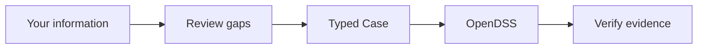

Learn · Public education

## Start small. Keep the evidence visible.

The notebook course is the browser-first way to explore CEPT. Each lesson keeps
three things separate: **what you provide**, **what OpenDSS calculates**, and
**what CEPT saves as evidence**. The bounded claim is `WORKFLOW_VALIDATED`; it
does not validate a physical project.

!!! info "Evidence boundary"
    The teaching package demonstrates solver-backed workflow evidence. A notebook PASS is not `PROJECT_VALIDATED`, field acceptance, or PowerFactory agreement. Real authenticated Colab execution remains a separate acceptance gate from repository-side notebook tests.

## Recommended path

Start

### 00 · Environment
Check that CEPT and OpenDSS are available and understand what a PASS can prove.

Core

### 01–05 · Learn the studies
Move from a tiny load flow to unbalanced IEEE13, hosting capacity, fault, and reproducibility.

[See all lessons](public-course.md){ .md-button }

Apply

### 06 · Bring your Case information
Paste incomplete information, review missing fields, choose a resolution policy, optionally ask OpenCode for help, then run a separate bounded demo.

Lesson 06

### Colab TUI
Tour the full CLI, then chat with the agent using your own key.

[Private source](https://github.com/sarutesri/cept-studio-edu/blob/main/public/notebooks/06_colab_tui.ipynb){ .cept-source-link target="_blank" rel="noopener" }

## Seven lessons

| Lesson | Focus | What stays visible |
| --- | --- | --- |
| **00 · Environment** | runtime and claim boundary | CEPT/OpenDSS identity |
| **01 · First circuit** | tiny two-bus load flow | source → line → load and voltage |
| **02 · IEEE13** | unbalanced three-phase feeder | phase-specific voltage |
| **03 · Hosting capacity** | PV search | declared criterion and capacity bracket |
| **04 · Fault study** | single-line-to-ground fault | solver-returned fault current |
| **05 · Reproducibility** | fingerprints and receipts | Case/result identity and checks |
| **06 · Case information + OpenCode** | incomplete real-world starting data | source/derived/missing/default/AI assumption status |

## Lesson 06: flexible input, strict truth

Lesson 06 is the bridge from a tutorial to real work. The learner may start
with a short note or, in the full CEPT/OpenCode workflow, several project-local
files. The assistant may organize and map the information, but it must not make
missing engineering parameters disappear.

The review has three policies:

- `strict` — source/derived values only;
- `assisted` — may use an explicitly approved, named documented default;
- `exploratory` — may additionally use an explicitly approved AI-selected assumption for a demonstrator.

Every policy blocks unresolved required inputs. Research intake remains
source-backed. A default and an AI-selected assumption are deliberately not the
same thing, and neither is presented as measurement evidence.

## Why the final demo is separate

The sample Case information in Lesson 06 intentionally omits a transformer
parameter. CEPT therefore does **not** solve that learner Case. The notebook
runs a bundled IEEE13 load-flow demonstration at the end so the learner can
still see a genuine OpenDSS run and verification receipt without laundering a
missing input into a fake result.

For the full Windows workflow with interactive SLD and report output, continue
to [Getting started](getting-started.md). For mixed source data and Case
preparation, see [Prepare a CEPT Case](case-preparation.md).

Found a confusing lesson or unexpected result?
[Report it](https://github.com/sarutesri/cept-studio/issues/new).
