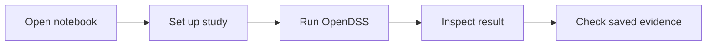

Learn · Preview

## Learn by running small examples.

The notebook course is the browser-first way to explore CEPT. Each lesson shows
what you set up, what OpenDSS calculates, and what CEPT saves for inspection.
The bounded claim is `WORKFLOW_VALIDATED`; it does not validate a physical
project. Open the notebooks in Google Colab; anonymous access follows the public mirror.

[See the course map](public-course.md){ .md-button }

!!! info "Preview status"
    The teaching package runs under Apache-2.0 with a `WORKFLOW_VALIDATED` bound; it does not validate a physical project. A passed real-Colab cold-start review is still pending.

## Choose a lesson

| Lesson | Try this |
| --- | --- |
| **00 · Environment** | Check the runtime and what a successful run means. |
| **01 · First circuit** | Build a tiny two-bus load flow and inspect voltage. |
| **02 · IEEE13** | Explore an unbalanced three-phase feeder. |
| **03 · Hosting capacity** | Increase PV and keep the voltage criterion visible. |
| **04 · Fault study** | Run a declared ground fault and inspect solver-returned current. |
| **05 · Reproducibility** | Follow fingerprints, saved artifacts, and checks. |

Lesson 00

### Environment
Check the runtime, package boundary, and claim scope.

[Private source](https://github.com/sarutesri/cept-studio-edu/blob/main/public/notebooks/00_environment.ipynb){ .cept-source-link target="_blank" rel="noopener" }

Lesson 01

### First circuit
Build a tiny two-bus load flow and inspect the returned voltage.

[Private source](https://github.com/sarutesri/cept-studio-edu/blob/main/public/notebooks/01_first_circuit_load_flow.ipynb){ .cept-source-link target="_blank" rel="noopener" }

Lesson 02

### IEEE13
Explore an unbalanced three-phase feeder.

[Private source](https://github.com/sarutesri/cept-studio-edu/blob/main/public/notebooks/02_ieee13_unbalanced.ipynb){ .cept-source-link target="_blank" rel="noopener" }

Lesson 03

### Hosting capacity
Increase PV while keeping the voltage criterion visible.

[Private source](https://github.com/sarutesri/cept-studio-edu/blob/main/public/notebooks/03_hosting_capacity.ipynb){ .cept-source-link target="_blank" rel="noopener" }

Lesson 04

### Fault study
Run a declared ground fault and inspect solver-returned current.

[Private source](https://github.com/sarutesri/cept-studio-edu/blob/main/public/notebooks/04_fault_study.ipynb){ .cept-source-link target="_blank" rel="noopener" }

Lesson 05

### Reproducibility
Follow fingerprints, saved artifacts, and checks.

[Private source](https://github.com/sarutesri/cept-studio-edu/blob/main/public/notebooks/05_validation_reproducibility.ipynb){ .cept-source-link target="_blank" rel="noopener" }

[Open the full lesson map](public-course.md){ .md-button }

## What these lessons are for

The notebooks demonstrate bounded solver-backed workflows. They are useful for
learning and reproducibility checks; they do **not** validate a physical project
or field installation.

For the full Windows workflow with interactive SLD and report output, continue
to [Getting started](getting-started.md).

Found a confusing lesson or unexpected result?
[Report it](https://github.com/sarutesri/cept-studio/issues/new).
