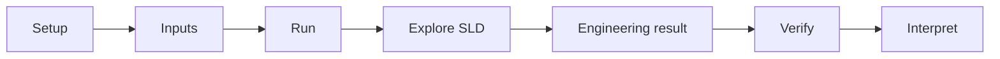

Learn · Public education

## Start small. Keep the evidence visible.

Eight notebooks with concise instructions, labelled step icons, and visible
`cept <noun> <verb>` commands.

**⚙ Setup → 🧩 Inputs → ▶ Run → 📊 Results → ✓ Verify → ◇ Interpret**

Inputs, solver outputs, and run evidence stay separate. Optional implementation
checks remain available. `WORKFLOW_VALIDATED` is not project validation.

!!! info "Evidence boundary"
    The teaching package demonstrates solver-backed workflow evidence. A notebook PASS is not `PROJECT_VALIDATED`, field acceptance, or PowerFactory agreement. Real authenticated Colab execution remains a separate acceptance gate from repository-side notebook tests.

```mermaid
flowchart LR
    A[Setup] --> B[Inputs]
    B --> C[Run]
    C --> D[Explore SLD]
    D --> E[Engineering result]
    E --> F[Verify]
    F --> G[Interpret]
```

## Recommended path

Start

### 00 · Environment and study scope
Check the runtime and the limits of workflow evidence.

Phase 1

### 01 · Convergence and model integrity
Compare recorded feeder outputs with omitted and declared voltage bases.

Phases 2–5

### 02–07 · Modelling, analysis, and evidence
Inspect typed networks, phase results, applied studies, and verification checks.

[See all lessons](public-course.md){ .md-button }

Apply

### 04 · Incomplete engineering data
Review missing inputs and approved resolutions; inspect a separate bundled demo.

[Private source](https://github.com/sarutesri/cept-studio-edu/blob/main/public/notebooks/04_incomplete_data.ipynb){ .cept-source-link target="_blank" rel="noopener" }

Terminal-first

### The same commands, in a notebook
Every lesson runs literal `cept <noun> <verb>` commands, exactly as in a normal terminal. Optional OpenCode help stays on the single researcher-facing `/cept` surface.

## The five phases

| Phase | Lesson | Focus | What stays visible |
| --- | --- | --- | --- |
| Setup | **00 · Environment and study scope** | runtime and claim scope | CEPT/OpenDSS identity |
| 1 · Model integrity | **01 · Convergence and model integrity** | voltage-base handling | recorded 0.316 / 0.948 pu example |
| 2 · Model construction | **02 · Typed network modelling** | Case to SLD | topology and voltage |
| 3 · Network conditions | **03 · Unbalanced feeder analysis** | IEEE13 phases | phase-specific voltage |
| 3 · Network conditions | **04 · Incomplete engineering data** | input policies | missing data and approved resolutions |
| 4 · Applied studies | **05 · Solar hosting capacity** | PV sweep | declared voltage criterion |
| 4 · Applied studies | **06 · Short-circuit analysis** | line-to-ground fault | solver-returned current |
| 5 · Evidence & reproducibility | **07 · Run evidence and reproducibility** | run verification | identity and integrity |

## Phase 1: model integrity

The direct example omits the downstream voltage base. The CEPT path carries
the declared bus voltage into the adapter. The recorded outputs illustrate why
convergence alone does not establish model correctness.

## Lesson 04: flexible input, strict truth

Lesson 04 is the bridge from a tutorial to real work. The learner may start
with a short note or, in the full CEPT/OpenCode workflow, several project-local
files. The assistant may organize and map the information, but it must not make
missing engineering parameters disappear.

The review has three policies:

- `strict` — source/derived values only;
- `assisted` — may use an explicitly approved, named documented default;
- `exploratory` — may additionally use an explicitly approved AI-selected assumption for a demonstrator.

Every policy blocks unresolved required inputs. Research intake remains
source-backed. A default and an AI-selected assumption are deliberately not the
same thing, and neither is presented as measurement evidence.

## Why the final demo is separate

The sample Case information in Lesson 04 intentionally omits a transformer
parameter. CEPT therefore does **not** solve that learner Case. The notebook
runs a bundled IEEE13 load-flow demonstration at the end so the learner can
still see a genuine OpenDSS run and verification receipt without laundering a
missing input into a fake result.

## Lesson 07: run evidence and reproducibility

Run the same Case twice. Compare identity and artifacts, then observe verification
after an artifact is changed. Hashes support integrity checks, not physical
correctness.

For the full Windows workflow with interactive SLD and report output, continue
to [Getting started](getting-started.md). For mixed source data and Case
preparation, see [Prepare a CEPT Case](case-preparation.md).

Found a confusing lesson or unexpected result?
[Report it](https://github.com/sarutesri/cept-studio/issues/new).
