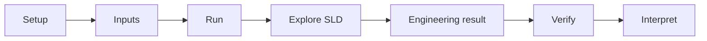

Learn · Public education

## Start small. Keep the evidence visible.

Nine notebooks with concise instructions and labelled step icons. Eight run
visible `cept` commands; Lesson 08 replays a recorded session.

**⚙ Setup → 🧩 Inputs → ▶ Run → 📊 Results → ✓ Verify → ◇ Interpret**

Inputs, solver outputs, and run evidence stay separate. Optional implementation
checks remain available. `WORKFLOW_VALIDATED` is not project validation.

!!! info "Evidence boundary"
    The teaching package demonstrates solver-backed workflow evidence. A notebook PASS is not `PROJECT_VALIDATED`, field acceptance, or PowerFactory agreement. Real authenticated Colab execution remains a separate acceptance gate from repository-side notebook tests.

```mermaid
flowchart LR
    A[Setup] --> B[Inputs]
    B --> C[Run]
    C --> D[Explore SLD]
    D --> E[Engineering result]
    E --> F[Verify]
    F --> G[Interpret]
```

## Recommended path

Start

### 00 · Check your setup
Check that the runtime is ready and what a passing check may claim.

Start

### 01 · Same feeder, two voltage bases
Compare recorded feeder outputs from an omitted and a declared voltage base.

Build to Assist

### 02–08 · Modelling, analysis, evidence, and an AI-assisted replay
Build a typed network, meet unbalance, ask planning questions, trace a result, and replay a recorded agent session.

[See all lessons](public-course.md){ .md-button }

Build

### 04 · When data is missing
Review missing inputs and approved resolutions; inspect a separate bundled demo.

[Private source](https://github.com/sarutesri/cept-studio-edu/blob/main/public/notebooks/04_incomplete_data.ipynb){ .cept-source-link target="_blank" rel="noopener" }

Terminal-first

### The same commands, in a notebook
Eight lessons run literal `cept` commands, exactly as in a normal terminal. Lesson 08 only replays a recorded session. Optional OpenCode help stays on the single researcher-facing `/cept` surface.

## The five stages

| Stage | Lesson | Focus | What stays visible |
| --- | --- | --- | --- |
| Start | **00 · Check your setup** | runtime and claim scope | CEPT/OpenDSS identity |
| Start | **01 · Same feeder, two voltage bases** | voltage-base handling | recorded 0.316 / 0.948 pu example |
| Build | **02 · Build your first network** | Case to SLD | topology and voltage |
| Build | **03 · Unbalanced phases** | IEEE13 phases | phase-specific voltage |
| Build | **04 · When data is missing** | input policies | missing data and approved resolutions |
| Apply | **05 · Solar hosting capacity** | PV sweep | declared voltage criterion |
| Apply | **06 · Short-circuit current** | line-to-ground fault | solver-returned current |
| Trust | **07 · Trace a result** | run verification | identity and integrity |
| Assist | **08 · Ask in plain words** | a recorded AI session | what the agent did, and what the checks decide |

## Lesson 01: same feeder, two voltage bases

The direct example omits the downstream voltage base. The CEPT path carries
the declared bus voltage into the adapter. The recorded outputs illustrate why
convergence alone does not establish model correctness.

## Lesson 04: flexible input, strict truth

Lesson 04 is the bridge from a tutorial to real work. The learner may start
with a short note or, in the full CEPT/OpenCode workflow, several project-local
files. The assistant may organize and map the information, but it must not make
missing engineering parameters disappear.

The review has three policies:

- `strict` — source/derived values only;
- `assisted` — may use an explicitly approved, named documented default;
- `exploratory` — may additionally use an explicitly approved AI-selected assumption for a demonstrator.

Every policy blocks unresolved required inputs. Research intake remains
source-backed. A default and an AI-selected assumption are deliberately not the
same thing, and neither is presented as measurement evidence.

## Why the final demo is separate

The sample Case information in Lesson 04 intentionally omits a transformer
parameter. CEPT therefore does **not** solve that learner Case. The notebook
runs a bundled IEEE13 load-flow demonstration at the end so the learner can
still see a genuine OpenDSS run and verification receipt without laundering a
missing input into a fake result.

## Lesson 07: trace a result

Run the same Case twice. Compare identity and artifacts, then observe verification
after an artifact is changed. Hashes support integrity checks, not physical
correctness.

## Lesson 08: ask in plain words

Lesson 08 replays a saved OpenCode session in which an agent issues short `cept`
commands, is refused once, and recovers. No model is called and no key is
needed. The transcript is a narrated observation; the saved verification files
decide. Running an agent live is opt-in and needs a provider you sign in to
yourself: never paste a key into a notebook. A short sketch of the workflow
recipe format is shown, but the recipe runtime is not part of the public wheel yet.

For the full Windows workflow with interactive SLD and report output, continue
to [Getting started](getting-started.md). For mixed source data and Case
preparation, see [Prepare a CEPT Case](case-preparation.md).

Found a confusing lesson or unexpected result?
[Report it](https://github.com/sarutesri/cept-studio/issues/new).
