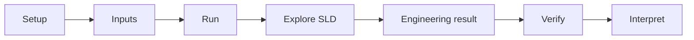

Learn · Public education

## Start small. Keep the evidence visible.

The notebook course is the browser-first way to explore CEPT, but it uses the
same terminal-first product surface as desktop CEPT: visible lesson cells run
literal `cept <noun> <verb>` commands and CEPT renders the human-readable
result. Lessons 01–04 use one simple sequence: **Setup → Inputs → Run → Explore
SLD → Engineering result → Verify → Interpret**. Direct OpenDSS/Python checks
stay collapsed at the optional tail instead of interrupting the learner path.
Each lesson keeps three things separate: **what you provide**, **what OpenDSS
calculates**, and **what CEPT saves as evidence**. The bounded claim is
`WORKFLOW_VALIDATED`; it does not validate a physical project.
The only setup is one short bootstrap cell; after it runs, each lesson uses a direct `!cept` command.

!!! info "Evidence boundary"
    The teaching package demonstrates solver-backed workflow evidence. A notebook PASS is not `PROJECT_VALIDATED`, field acceptance, or PowerFactory agreement. Real authenticated Colab execution remains a separate acceptance gate from repository-side notebook tests.

```mermaid
flowchart LR
    A[Setup] --> B[Inputs]
    B --> C[Run]
    C --> D[Explore SLD]
    D --> E[Engineering result]
    E --> F[Verify]
    F --> G[Interpret]
```

## Recommended path

Start

### 00 · Before you start
Check that CEPT and OpenDSS are available and understand what a PASS can prove.

Phase 1

### 01 · Why solvers lie
Watch an AI-written OpenDSS script converge on a wrong model: 0.316 pu at the load bus, with no warning at all. Then the same feeder through CEPT: 0.948 pu.

Phases 2–5

### 02–07 · Build it, then trust it
Build a first circuit and see its SLD, meet an unbalanced feeder and incomplete data, ask what solar and faults do, then prove the result with a digital receipt.

[See all lessons](public-course.md){ .md-button }

Apply

### 04 · Bring your Case information
Paste incomplete information, review missing fields, choose a resolution policy, optionally ask OpenCode for help, then run a separate bounded demo.

[Private source](https://github.com/sarutesri/cept-studio-edu/blob/main/public/notebooks/04_incomplete_data.ipynb){ .cept-source-link target="_blank" rel="noopener" }

Terminal-first

### The same commands, in a notebook
Every lesson runs literal `cept <noun> <verb>` commands, exactly as in a normal terminal. Optional OpenCode help stays on the single researcher-facing `/cept` surface.

## The five phases

| Phase | Lesson | Focus | What stays visible |
| --- | --- | --- | --- |
| Prologue | **00 · Before you start** | runtime and claim boundary | CEPT/OpenDSS identity |
| 1 · The aha | **01 · Why solvers lie** | convergence is not correctness | 0.316 pu error versus 0.948 pu CEPT result |
| 2 · Build it | **02 · First circuit** | typed Case to single-line diagram | source → line → load and voltage |
| 3 · Real network | **03 · IEEE13** | unbalanced three-phase feeder | phase-specific voltage |
| 3 · Real network | **04 · Case information + OpenCode** | incomplete real-world starting data | source/derived/missing/default/AI assumption status |
| 4 · Active grid | **05 · Hosting capacity** | PV search | declared criterion and capacity bracket |
| 4 · Active grid | **06 · Fault study** | single-line-to-ground fault | solver-returned fault current |
| 5 · Trust | **07 · Digital receipt** | fingerprints and receipts | Case/result identity and checks |

## Phase 1: the wrong answer first

Lesson 01 opens the course on purpose. An AI-written OpenDSS script omits the
downstream voltage base, the solver converges, and the load bus reports
0.316 pu with no warning. The same feeder declared as a typed Case returns
0.948 pu. Nothing about the solver changed — only what was validated before it
was asked to solve. That is the whole argument for a bridge layer, and the
course spends its remaining six lessons making that bridge concrete.

## Lesson 04: flexible input, strict truth

Lesson 04 is the bridge from a tutorial to real work. The learner may start
with a short note or, in the full CEPT/OpenCode workflow, several project-local
files. The assistant may organize and map the information, but it must not make
missing engineering parameters disappear.

The review has three policies:

- `strict` — source/derived values only;
- `assisted` — may use an explicitly approved, named documented default;
- `exploratory` — may additionally use an explicitly approved AI-selected assumption for a demonstrator.

Every policy blocks unresolved required inputs. Research intake remains
source-backed. A default and an AI-selected assumption are deliberately not the
same thing, and neither is presented as measurement evidence.

## Why the final demo is separate

The sample Case information in Lesson 04 intentionally omits a transformer
parameter. CEPT therefore does **not** solve that learner Case. The notebook
runs a bundled IEEE13 load-flow demonstration at the end so the learner can
still see a genuine OpenDSS run and verification receipt without laundering a
missing input into a fake result.

## Lesson 07: the digital receipt

Lesson 07 closes the course on trust. It runs the identical Case twice, shows
that attempt ids differ while every engineering answer is byte-identical, and
then shows what happens when an artifact is edited afterwards: verification
breaks loudly instead of quietly agreeing with a number someone edited in a
spreadsheet.

For the full Windows workflow with interactive SLD and report output, continue
to [Getting started](getting-started.md). For mixed source data and Case
preparation, see [Prepare a CEPT Case](case-preparation.md).

Found a confusing lesson or unexpected result?
[Report it](https://github.com/sarutesri/cept-studio/issues/new).
